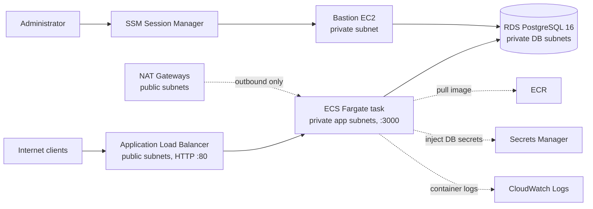

# LegacyLens Core Infrastructure

Terraform-managed AWS environment in `ap-south-1` (Mumbai) for a multi-tenant Node.js backend: a three-tier VPC, a containerized app on ECS Fargate behind an Application Load Balancer, and an isolated PostgreSQL database with Row-Level Security for tenant data separation.

This repository is a hands-on engineering project built while preparing for AWS cloud support and implementation roles. The [status table](#build-log-and-status) at the bottom is explicit about what is in the code and what was a lab step.

## Architecture



**Network layout** (`terraform/vpc.tf`): one VPC (`10.38.0.0/16`) across two Availability Zones, each with a public subnet, a private application subnet and a private database subnet. There is an Internet Gateway, one NAT Gateway per AZ, and separate route tables for the public, application and database tiers. The database route table has no default route. A second VPC (`10.37.0.0/16`) with two private subnets is provisioned alongside; nothing is attached to or peered with it in the current code.

## Repository layout

| Path | Contents |
|---|---|
| `terraform/` | VPC and subnets (`vpc.tf`), security groups, bastion, SSM, RDS and Secrets Manager (`main.tf`), ECR (`ecr.tf`), ECS cluster, task and service (`ecs.tf`), ALB (`alb.tf`), variables, and `connect-db.ps1` (opens an SSM port-forward to the database) |
| `app/` | Node.js service (`server.js`) with `/health` and `/webhook` endpoints, and a multi-stage `Dockerfile` |
| `database/` | Tenant schema and RLS policy, migration, index tuning, lock diagnostics, and an RLS test script |

## Security design

- **Network isolation:** the application and database tiers sit in private subnets. The database accepts connections on port 5432 only from the application and bastion security groups, referenced by security group rather than by IP range.
- **No open SSH:** administrative access uses SSM Session Manager through VPC interface endpoints (`ssm`, `ssmmessages`, `ec2messages`). The endpoint security group allows HTTPS from inside the VPC only.
- **Credentials:** the database password is generated by Terraform (`random_password`) and stored in AWS Secrets Manager. ECS injects the values into the container as secrets, so they are not in the image or the task definition's plain environment. The ECS execution role is scoped to pulling the image, reading those secrets and writing logs.
- **Data at rest:** RDS storage encryption is enabled.
- **Container hardening:** multi-stage build on `node:22-alpine`, production dependencies only, runs as the non-root `node` user, with a container health check. The ECR repository has a lifecycle policy.
- **Repository hygiene:** `.gitignore` excludes Terraform state, `*.tfvars` and `.env`. Credentials are read from environment variables in all application and test code.

## Multi-tenant data isolation

Tenant separation is enforced inside PostgreSQL with Row-Level Security (`database/01_tenant_isolation.sql`):

```sql
ALTER TABLE orders ENABLE ROW LEVEL SECURITY;

CREATE POLICY tenant_isolation ON orders
    FOR ALL TO PUBLIC
    USING (tenant_id = NULLIF(current_setting('app.current_tenant', true), '')::UUID);
```

The application sets `app.current_tenant` for the current transaction, for example with `SELECT set_config('app.current_tenant', $1, true)`. If it is unset, the policy matches no rows. Because the database enforces this, a query missing a `WHERE tenant_id = ...` clause still cannot read another tenant's rows.

Note: RLS does not apply to the table owner unless `ALTER TABLE orders FORCE ROW LEVEL SECURITY` is set, so tests should run as a separate, non-owner application role.

## Deploy

Prerequisites: Terraform, AWS CLI with credentials, Docker, Node.js 22.

1. **Infrastructure**
   ```bash
   cd terraform
   terraform init
   terraform plan
   terraform apply
   ```
2. **Build and push the image**
   ```bash
   aws ecr get-login-password --region ap-south-1 | docker login --username AWS --password-stdin <account-id>.dkr.ecr.ap-south-1.amazonaws.com
   docker build -t legacylens-bot ./app
   docker tag legacylens-bot:latest <ecr-repository-url>:latest
   docker push <ecr-repository-url>:latest
   ```
3. **Database access and schema:** run `terraform/connect-db.ps1` to open an SSM port-forward to the database on `localhost:5432`, then apply the files in `database/` in order (`01_tenant_isolation.sql`, then `day10_schema_migration.sql`, `day11_index_tuning.sql`).
4. **RLS test:** set `DB_HOST`, `DB_USER` and `DB_PASSWORD` in a local `.env` (never commit it) and run `node database/test-rls.js`.
5. **Tear down when finished:** `terraform destroy`.

## Cost notes

The main hourly costs are the two NAT Gateways, the Application Load Balancer, the Fargate task and the RDS instance (`db.t4g.micro`). This is a lab environment, so destroy it when not in use.

## Known limitations

- The ALB listener is HTTP on port 80. TLS with an ACM certificate is not in the Terraform yet.
- RDS runs as a single instance (`multi_az = false`) with 1 day of backup retention, and `skip_final_snapshot` and `deletion_protection = false` are set for easy teardown. Production would use Multi-AZ, longer retention and deletion protection.
- The ECS service runs one task.
- `test-rls.js` uses `rejectUnauthorized: false` for the lab connection. Production should verify the RDS CA certificate.
- There is no CI/CD workflow, CloudWatch alarm or VPC Flow Log configuration in this repository yet.

## Build log and status

This project was built step by step. The table separates what is in the repository code from lab steps performed outside it.

| Day | Topic | Status |
|---|---|---|
| 1-4 | VPC, subnets, IGW, NAT, EC2 bastion, key pairs, security group referencing | In repo (`vpc.tf`, `main.tf`) |
| 5-6 | RDS PostgreSQL in private subnets, access via bastion | In repo (`main.tf`) |
| 7-8, 13 | Node.js runtime, `pg` pool, schema-per-tenant experiment | Lab steps on the server |
| 9-12 | SSM access, migrations, indexes, lock diagnostics, Terraform refactor | In repo (`database/`, `terraform/`) |
| 14 | Transit Gateway hub | Earlier iteration (`tgw.tf`, removed from current code, visible in history) |
| 15 | Site-to-Site VPN with a simulated on-premises router | Earlier iteration (`vpn.tf`, removed from current code, visible in history) |
| 16 | Row-Level Security | In repo (`database/01_tenant_isolation.sql`) |
| 17 | Dockerfile and ECR | In repo (`app/Dockerfile`, `ecr.tf`) |
| 18 | PgBouncer and systemd limits | Lab steps on the server, no config files in repo |
| 19 | ECS Fargate service in private subnets, secrets from Secrets Manager | In repo (`ecs.tf`) |
| 20 | Application Load Balancer with `/health` target group | In repo (`alb.tf`), HTTP only |
| 21 | CI/CD with GitHub Actions and OIDC | Not in repo |
| 22 | Observability: ECS logs to CloudWatch, flow logs, alarms | ECS log driver in repo (`ecs.tf`), flow logs and alarms not in repo |
